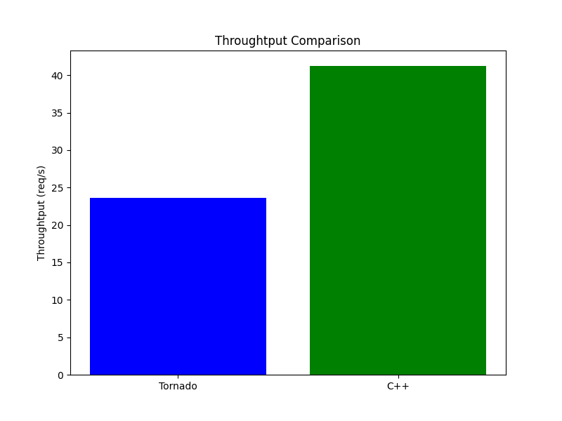
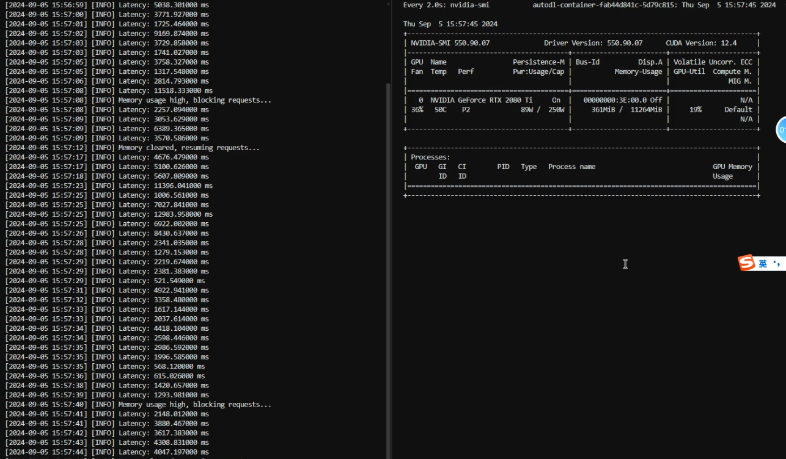

# TrWebOCR.cpp

> Read this in [English](README_EN.md)

基于[Tr](https://github.com/myhub/tr)的高吞吐量推理引擎，使用C++编写serving后端，兼容Ubuntu 20.04+的linux环境。

最初做这份代码，是因为公司有比较要紧的任务，要在短时间内跑完20万条数据的OCR识别，一方面是生产环境要限制成本，不可能全部使用大模型来跑数据，OCR识别的可信率在60%左右（人工认为的满意度），目前在生产前线，OCR仍然是一个有用的、高效的文字提取方案；另一方面是原本Tornado backend使用的是协程支持，在推理方面的速度对于当时公司的任务以及领导给定的DDL来说并不能完全满足，于是自己写了一套新的serving backend，提高部署Web服务的请求吞吐量。

这份代码库依赖于：

+ [httplib](https://github.com/yhirose/cpp-httplib)：C++网络库，对于开发Pythonic backend的人比较友好，因为设计理念相近，基本上开箱即用。
+ [nlohmann/json](https://github.com/nlohmann/json)：json库，处理json数据的，非常方便。

这两个C++库的设计都遵循`one header file only`，也就是仅仅只有一份头文件，只需要include就可以使用，极大地降低了环境配置与编译带来的心智负担。这三份代码我已经存放在`3rd_party`中，CMake也已经配置好，无需使用者自行拉取、链接、编译。

+ [opencv](https://github.com/opencv/opencv)：主要用来读取图像文件，尝试了不同的轻量级读取图片库例如`stb_image`等，发现在读取图片的结果上与pillow、opencv的读取结果又出入。因为底层的`tr_run`处于黑盒状态，不知道它期待接收的图片数据是什么，所以采用了与原仓库中同样的读取手段。其实对于opencv库，我们用到的仅仅只有读取功能、转化灰度功能。


**TrWebOCR.cpp的宗旨是：让我们的OCR service尽量快捷、轻盈、高效。**


# 特性

考虑到 [Tr](https://github.com/myhub/tr) 这个OCR库仅仅只提供了`.so`文件，没有任何人能够知道它底层是怎么实现的，所以有关这个接口的使用，只能借鉴`TrWebOCR`中的调用方案管中窥豹，推测`tr_run`等函数接口的参数类型是什么，并且基于Tr库里面提供的一些例子，我们大致可以推测：

+ `tr_run`这个函数是可以多线程运行的，并且底层的计算资源不会打架、不会发生竞争读取等异步错误，上层可以轻松将其多线程运行，这对于降低请求延迟、提高系统吞吐量是至关重要的。
+ 在最新的Tr 2.6、2.8中，`tr_run`函数的输入可以是一张本地图片的绝对路径，也可以是`uint8_t*`类型的数组。


`TrWebOCR.cpp`有如下特性：

+ **高性能OCR Web推理**
+ Update with Tr 2.8
+ 支持上传图片文件、图片base64编码
+ 支持图像旋转
+ CUDA内存管理，规避`Out of Memory`问题。


在推理过程中，随着上传的数据增多，底层的显存占用量会不断增长，直至最后发生OOM。这个是`TrWebOCR`中也存在的问题，cpp项目开发初期也遇到了这个问题，当时的方案就是：挂掉了又重启，但是这并不是长久之计。

`TrWebOCR.cpp`的方案是：使用一个监视线程，结合CUDA API: `CUDADeviceReset()`，暴力解决这个问题。监视线程会定时检查显存占用情况，如果有OOM风险，会block住serving进展，进行重启之后，再开始继续serving。

**这样做不会影响性能吗？**显然是会的，但是**比起不让服务挂掉、在生产环境稳定地跑数据，这个容灾措施是必要的。**

> 补充：CUDA OOM问题是由于tr底层算子导致的。由于我们都不知道底层算子是怎么实现的、哪里有内存泄漏，所以对于上层的引擎来说，只能选择清空显存、重新load这样的操作来解决这个问题。


# 快速上手

## Step 1: git clone

首先把仓库clone下来，并且拉取git submodules (也就是Tr)：

```bash
git clone https://github.com/SamuraiBUPT/TrWebOCR.cpp.git
cd TrWebOCR.cpp
git submodule update --init --recursive
```

## Step 2: 安装opencv、nvcc （如果已经安装了dev包，可以跳过这一步）
通过这个指令一键安装opencv4：
```bash
sudo apt install libopencv-dev
```

通过如下指令验证是否安装成功：

```bash
pkg-config --modversion opencv4
```

如果看见输出：

```
4.2.0
```

就意味着安装成功了。


__准备nvcc__

如果您考虑使用GPU进行部署，那么必须要准备好`nvcc`，因为要对NV显卡进行显存清理操作。

```bash
nvcc -V
```

如果有正常输出，就说明环境没有问题；

反之没有的话，需要配置nvcc相关环境。配置方法直接搜**安装cuda nvcc**之类的关键字即可。


## Step 3: 编译
然后开始编译代码：

```bash
mkdir build && cd build

# 如果使用CPU部署，在CMake生成的时候设置 USE_GPU 这个宏
cmake -DUSE_GPU=OFF ..

# 如果使用GPU，在CMake生成的时候就像这样设置
cmake -DUSE_GPU=ON ..

# 直接编译
make
```

如果编译完成都没有错误的话，可以直接启动：

```bash
./main
```

至于发送请求，可以使用`scripts`路径中的脚本：

```bash
cd scripts
python test_api.py
```


## TODO

+ [x] support inference
+ [x] GPU support
+ [x] Flexible image serving
+ [x] Support Chinese OCR.
+ [x] Support Image Rotation.
+ [x] CUDA memory management.
+ [x] CMake Macro: choose rotation, choose CUDA GC enabling or not.
+ [ ] Support ARM platform.
+ [ ] Build dockerfile.


# Benchmark

### Inference Latency
__CPU Mode__

+ 100 个请求
+ 并发量为20


__GPU Mode__

+ 100个请求
+ 并发量为20


cpp后端似乎比Tornado在推理支持方面，有更稳定的计算曲线。


### GPU利用率比较

> GPU: cpp后端
```
+-----------------------------------------------------------------------------------------+
| NVIDIA-SMI 550.90.07              Driver Version: 550.90.07      CUDA Version: 12.4     |
|-----------------------------------------+------------------------+----------------------+
| GPU  Name                 Persistence-M | Bus-Id          Disp.A | Volatile Uncorr. ECC |
| Fan  Temp   Perf          Pwr:Usage/Cap |           Memory-Usage | GPU-Util  Compute M. |
|                                         |                        |               MIG M. |
|=========================================+========================+======================|
|   0  NVIDIA GeForce RTX 2080 Ti     On  |   00000000:B2:00.0 Off |                  N/A |
| 33%   45C    P2            135W /  250W |    2673MiB /  11264MiB |     73%      Default |
|                                         |                        |                  N/A |
+-----------------------------------------+------------------------+----------------------+

+-----------------------------------------------------------------------------------------+
| Processes:                                                                              |
|  GPU   GI   CI        PID   Type   Process name                              GPU Memory |
|        ID   ID                                                               Usage      |
|=========================================================================================|
+-----------------------------------------------------------------------------------------+
```

GPU: Tornado后端

```
+-----------------------------------------------------------------------------------------+
| NVIDIA-SMI 550.90.07              Driver Version: 550.90.07      CUDA Version: 12.4     |
|-----------------------------------------+------------------------+----------------------+
| GPU  Name                 Persistence-M | Bus-Id          Disp.A | Volatile Uncorr. ECC |
| Fan  Temp   Perf          Pwr:Usage/Cap |           Memory-Usage | GPU-Util  Compute M. |
|                                         |                        |               MIG M. |
|=========================================+========================+======================|
|   0  NVIDIA GeForce RTX 2080 Ti     On  |   00000000:B2:00.0 Off |                  N/A |
| 33%   45C    P2            135W /  250W |     875MiB /  11264MiB |    39%       Default |
|                                         |                        |                  N/A |
+-----------------------------------------+------------------------+----------------------+

+-----------------------------------------------------------------------------------------+
| Processes:                                                                              |
|  GPU   GI   CI        PID   Type   Process name                              GPU Memory |
|        ID   ID                                                               Usage      |
|=========================================================================================|
+-----------------------------------------------------------------------------------------+
```

在这里可以明显看出，在并发20个请求的时候，Tornado在GPU模式里面，无论是显存占用还是GPU利用率都没有CPP 后端高，个人认为可能是Tornado使用的协程，没法真正做到并行推理。这也能解释为什么cpp做了多线程处理之后要快一点。


### 吞吐量

在10000的个请求的数量级上进行测试，并发量为20，用的都是一个图像测试数据，开启GPU进行测试。




# demo部署展示

测试图片：


demo视频：


进行显存管理、自动释放、重启的demo截图：




# 鸣谢

+ [TrWebOCR](https://github.com/alisen39/TrWebOCR)