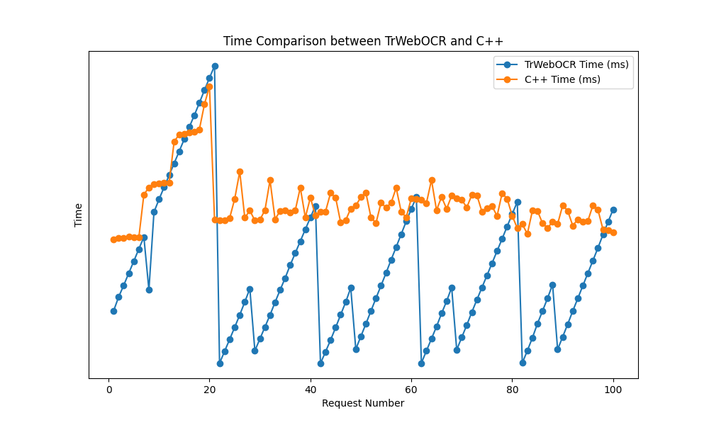

# TrWebOCR.cpp

High throughput & inference engine for [Tr](https://github.com/myhub/tr) with cplusplus extensions, updated for environments like ubuntu 20.04+.

The web service depends on:

+ [httplib](https://github.com/yhirose/cpp-httplib)
+ [nlohmann/json](https://github.com/nlohmann/json)
+ [stb](https://github.com/nothings/stb)

These three repository adopt `one header file only` way, which is convenient for web service developing.

**Let's just keep it simple, and fast.**


**Note: this project is still in early development and not ready for production use. May finish in several days.**


# Environment and settings

As the release files from [Tr](https://github.com/myhub/tr) has only `.so` files, we can never figure out how it was implemented, but following the tutorials and examples from the scripts it offered, we may **infer** that:

+ The `tr_run` function can be executed in multi-threads environment, which is of vital importance to accelerate the inference latency and throughput.
+ The input of `tr_run` function can be a path of local image, or the pointer of ndarray, for easy-development reasons I adopt `local image path` (const char*) as input. Another kind of input will try later.

# Quick start

git clone & fetch submodules:

```bash
git clone https://github.com/SamuraiBUPT/TrWebOCR.cpp.git
cd TrWebOCR.cpp
git submodule update --init --recursive
```

And then build the project:

```bash
mkdir build && cd build

# without GPU
cmake -DUSE_GPU=OFF ..

# with GPU
cmake -DUSE_GPU=ON ..

# compile
make
```

and if there is no error, you can run the server:

```bash
./main
```

as for requests, you may use python:

```bash
cd scripts
python test_api.py
```

## TODO
+ [x] support inference
+ [x] GPU support
+ [x] Flexible image serving (**In progress**)
+ [ ] Support Chinese OCR.
+ [ ] Image rotation C++ implement.

# Benchmark

### Inference Latency
__CPU Mode__

+ Num=100 requests
+ Concurrency=20


__GPU Mode__

+ Num=100 requests
+ Concurrency=20



The Cplusplus backend seems to offer more stable service than tornado backend.

### GPU Utilization

And the GPU utilization comparison:

> GPU: Cplusplus backend
```
+-----------------------------------------------------------------------------------------+
| NVIDIA-SMI 550.90.07              Driver Version: 550.90.07      CUDA Version: 12.4     |
|-----------------------------------------+------------------------+----------------------+
| GPU  Name                 Persistence-M | Bus-Id          Disp.A | Volatile Uncorr. ECC |
| Fan  Temp   Perf          Pwr:Usage/Cap |           Memory-Usage | GPU-Util  Compute M. |
|                                         |                        |               MIG M. |
|=========================================+========================+======================|
|   0  NVIDIA GeForce RTX 2080 Ti     On  |   00000000:B2:00.0 Off |                  N/A |
| 33%   45C    P2            135W /  250W |    2673MiB /  11264MiB |     73%      Default |
|                                         |                        |                  N/A |
+-----------------------------------------+------------------------+----------------------+

+-----------------------------------------------------------------------------------------+
| Processes:                                                                              |
|  GPU   GI   CI        PID   Type   Process name                              GPU Memory |
|        ID   ID                                                               Usage      |
|=========================================================================================|
+-----------------------------------------------------------------------------------------+
```

GPU: Tornado backend

```
+-----------------------------------------------------------------------------------------+
| NVIDIA-SMI 550.90.07              Driver Version: 550.90.07      CUDA Version: 12.4     |
|-----------------------------------------+------------------------+----------------------+
| GPU  Name                 Persistence-M | Bus-Id          Disp.A | Volatile Uncorr. ECC |
| Fan  Temp   Perf          Pwr:Usage/Cap |           Memory-Usage | GPU-Util  Compute M. |
|                                         |                        |               MIG M. |
|=========================================+========================+======================|
|   0  NVIDIA GeForce RTX 2080 Ti     On  |   00000000:B2:00.0 Off |                  N/A |
| 33%   45C    P2            135W /  250W |     875MiB /  11264MiB |    39%       Default |
|                                         |                        |                  N/A |
+-----------------------------------------+------------------------+----------------------+

+-----------------------------------------------------------------------------------------+
| Processes:                                                                              |
|  GPU   GI   CI        PID   Type   Process name                              GPU Memory |
|        ID   ID                                                               Usage      |
|=========================================================================================|
+-----------------------------------------------------------------------------------------+
```

I think there has something to do with the GPU utilization in Tornado backend, and that can be one of the reasons why the C++ backend is faster.

### Throughput

Test on 10000 requests, concurrency=20, same images dataset, GPU mode.

